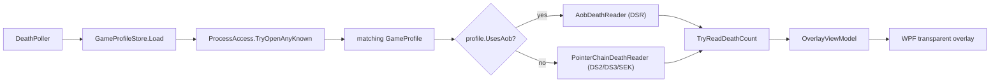

# DSDeathOverlay

External, **read-only** in-game death counter for the FromSoftware Souls games.

A small WPF window that sits on top of the game, displays your current death
count, and never touches a single byte of the game's memory or files. No DLL
injection, no `WriteProcessMemory`, no `CreateRemoteThread`. Same technique as
the public projects [DSDeaths](https://github.com/Quidrex/DSDeaths) and
[DSDC](https://github.com/cisc0disco/DSDC).

## Supported games

| Tag  | Game                                       | Process name             | How it's located                       |
| ---- | ------------------------------------------ | ------------------------ | -------------------------------------- |
| DSR  | Dark Souls: Remastered                     | `DarkSoulsRemastered.exe`| **AOB scan** (patch-resilient)         |
| DS2  | Dark Souls II: Scholar of the First Sin    | `DarkSoulsII.exe`        | Pointer chain (current patch)          |
| DS3  | Dark Souls III                             | `DarkSoulsIII.exe`       | Pointer chain (current patch)          |
| SEK  | Sekiro: Shadows Die Twice                  | `sekiro.exe`             | Pointer chain (current patch)          |

The overlay auto-detects whichever supported game is running and switches the
on-screen tag accordingly (e.g. `DS3 - Deaths: 42`). DSR uses an array-of-bytes
scan that survives small patches; the others use module-relative pointer chains
ported from DSDeaths and will need their offsets refreshed if From ships an
update — see [Updating offsets](#updating-offsets-when-a-patch-breaks-things).

### Elden Ring is intentionally excluded

Elden Ring uses **Easy Anti-Cheat (EAC)**, which actively blocks
`ReadProcessMemory` from outside processes. Making the overlay work would
require disabling EAC (and forfeiting online play); EAC is meaningfully
riskier than the Steam-side detection the older games have. If you want this,
use [DSDeaths](https://github.com/Quidrex/DSDeaths) directly and follow its
warnings.

## Safety

- The overlay opens the game's process handle with **only** `PROCESS_VM_READ |
  PROCESS_QUERY_INFORMATION` (`0x0410`). It cannot write to the game even if it
  wanted to.
- It does **not** drop any files into the game install folder.
- It runs as a **separate process** at the same integrity level as your normal
  Steam launch (no admin required).
- No DLL injection, no `CreateRemoteThread`, no `WriteProcessMemory`.
- The technique is the same one used by the death counters above and has been
  considered safe by their communities for years. Still: **use at your own
  risk.** Anti-cheat behaviour can change without notice.

## Requirements

- Windows 10 or 11 (x64).
- .NET 9 runtime (only needed for a non-self-contained build; the `publish`
  command below produces a single self-contained `.exe`).
- The game set to **Borderless Fullscreen** (Options -> Display Settings).
  A WPF overlay cannot draw on top of true exclusive fullscreen.

## Build

```powershell
dotnet build DSDeathOverlay.sln -c Release
```

Or, for a single-file self-contained binary you can copy anywhere:

```powershell
dotnet publish src/DSDeathOverlay/DSDeathOverlay.csproj -c Release `
  -r win-x64 --self-contained true -p:PublishSingleFile=true `
  -p:IncludeNativeLibrariesForSelfExtract=true
```

The output is `src/DSDeathOverlay/bin/Release/net9.0-windows/win-x64/publish/DSDeathOverlay.exe`.

## Run

1. Start any supported From game.
2. Set it to **Borderless Fullscreen**.
3. Launch `DSDeathOverlay.exe`. The counter appears at the top-left with the
   matching game tag.

The overlay shows a status string while it's still working things out:

- `Deaths: --   (waiting for game)` - no supported game is running.
- `DS3 - Deaths: --   (locating)` - found the game, performing one-time setup.
- `DS3 - Deaths: --   (load a save)` - on the title screen / no character loaded.
- `DS3 - Deaths: 42` - reading live values.

## Hotkeys

| Key  | Action |
| ---- | --- |
| `F8` | Toggle **edit mode**. The background tints purple and the window becomes draggable with the left mouse button. Click-through is restored when you press F8 again. |
| `F9` | Show/hide the overlay. |

Position and font size are saved to
`%LOCALAPPDATA%\DSDeathOverlay\settings.json` when the app exits.

## Updating offsets when a patch breaks things

If a game patch shifts the pointer chain and the overlay starts reading
garbage (or zero) for DS2 / DS3 / Sekiro, edit `games.json` next to
`DSDeathOverlay.exe`:

```json
{
  "games": [
    {
      "displayName": "Dark Souls III",
      "shortTag": "DS3",
      "processName": "DarkSoulsIII",
      "moduleName": "DarkSoulsIII.exe",
      "chainOffsets64": [ 74867384, 152 ]
    }
  ]
}
```

`chainOffsets64` is walked exactly the same way DSDeaths does it: start at
`module_base`, for each offset add it then dereference 8 bytes (4 for
`chainOffsets32`), interpret the low 32 bits of the last deref as the death
count. The shipped values are the ones from the current DSDeaths master at
the time this was written; check that project for newer numbers if they break.

DSR is unaffected: its AOB pattern keeps matching as long as the surrounding
instructions don't change. If even that breaks, update the `aobPattern`
field in the DSR entry.

If `games.json` is missing or malformed, the app falls back to the embedded
copy baked into the .exe so it always boots.

## Diagnostics

If the counter never appears, check `deaths.log` next to `DSDeathOverlay.exe`.
It records: process opens, the AOB hit address, pointer-chain bitness, and
any read failures.

## How it works



1. Load `games.json` (external file beats embedded fallback).
2. Find any supported game's process; open it with read-only access; detect
   bitness via `IsWow64Process`.
3. Build the right reader for the matched game:
   - **AOB**: scan the main module for the cheat-engine-style pattern,
     resolve the RIP-relative `mov` to get a static pointer slot, dereference
     it on each tick, read the 4-byte death count at the configured offset.
   - **Pointer chain**: walk the module-relative offset list a la DSDeaths.
4. Render `Deaths: N` in a transparent topmost click-through WPF window.
   Re-assert `HWND_TOPMOST` once per second so the overlay survives
   borderless-fullscreen focus changes.

## Layout

```
DarkSoulsRemasteredDeathCounter/
  DSDeathOverlay.sln
  README.md
  src/DSDeathOverlay/
    App.xaml(.cs)
    MainWindow.xaml(.cs)              # transparent topmost click-through window
    OverlayViewModel.cs               # DisplayText with per-game tag
    BoolToBrushConverter.cs
    app.manifest                      # asInvoker (no UAC), Per-Monitor DPI
    games.json                        # game profiles (also embedded as fallback)
    Memory/
      NativeMethods.cs                # P/Invoke (kernel32, psapi, user32)
      IMemoryReader.cs                # abstraction for unit-testable reads
      ProcessAccess.cs                # OpenProcess + module enum (read-only)
      PatternScanner.cs               # pure AOB+mask scanner (unit-tested)
      GameProfile.cs                  # per-game record
      GameProfileStore.cs             # loads games.json (file beats embedded)
      IDeathReader.cs                 # interface for the two reader strategies
      AobDeathReader.cs               # DSR: pattern scan + RIP-relative
      PointerChainDeathReader.cs      # DS2/DS3/SEK: walk fixed offset chain
    Services/
      DeathPoller.cs                  # 250ms loop; auto-reconnects between games
    Settings/
      SettingsStore.cs                # JSON persistence under %LOCALAPPDATA%
    Logging/
      ILogger.cs
      FileLogger.cs                   # deaths.log next to the exe
  test/DSDeathOverlay.Tests/
    PatternScannerTests.cs            # AOB + mask scanner
    PointerChainWalkTests.cs          # DSDeaths-style walker (incl. 32-bit)
    GameProfileStoreTests.cs          # JSON parsing + embedded fallback
    FakeMemoryReader.cs               # in-memory IMemoryReader for tests
```

## Credits

- DSR pattern + offset: [JohrnaJohrna/RemasterCETable](https://github.com/JohrnaJohrna/RemasterCETable).
- DS2 / DS3 / Sekiro pointer chains: ported from
  [Quidrex/DSDeaths](https://github.com/Quidrex/DSDeaths) `Program.cs`.
- Prior art: [Quidrex/DSDeaths](https://github.com/Quidrex/DSDeaths),
  [cisc0disco/DSDC](https://github.com/cisc0disco/DSDC).

## License

This project is provided as-is for personal use. Dark Souls: Remastered,
Dark Souls II: SotFS, Dark Souls III, and Sekiro: Shadows Die Twice are
copyright FromSoftware / Bandai Namco / Activision respectively.
